# Introdução

Informações básicas do projeto.

- **Projeto:** Protege Plus
- **Repositório GitHub:** https://github.com/ICEI-PUC-Minas-PMGES-TI/pmg-es-2026-1-ti1-0427200-protege
- **Membros da equipe:**
  - [Anna Luiza Pereira Silva](https://github.com/annaluizapsilva-03)
  - [Beatriz Almeida Andrade](https://github.com/biaalmeidaandradee7-crypto)
  - [Giovana Faria Martins](https://github.com/giovanafariaa)
  - [Lukas Nathan Matos Candeia](https://github.com/cicrano)
  - [Maria Luiza Queiroz Martins da Silva](https://github.com/mariaqueirozz)
  - [Matheus Campos Pereira](https://github.com/Matheuscamp)

A documentação do projeto é estruturada da seguinte forma:

1. Introdução
2. Contexto
3. Product Discovery
4. Product Design
5. Metodologia
6. Solução
7. Referências Bibliográficas

✅ [Documentação de Design Thinking (MIRO)](files/Protege+_processo.pdf)

# Contexto

Detalhes sobre o espaço de problema, os objetivos do projeto, sua justificativa e público-alvo.

## Problema

A violência doméstica é um problema social grave e persistente no Brasil. Muitas vítimas — mulheres, crianças, idosas e pessoas LGBTQIA+ — enfrentam barreiras significativas para buscar ajuda: o medo de represálias, a dependência emocional e financeira do agressor, a falta de informação sobre os canais de denúncia disponíveis e o risco de ser descoberta ao tentar pedir socorro.

Em muitos casos, a vítima não pode simplesmente ligar para uma delegacia ou sair de casa para registrar uma ocorrência, pois está sob vigilância constante ou em situação de vulnerabilidade extrema. O processo de denúncia tradicional, burocrático e presencial, acaba sendo inacessível justamente para quem mais precisa dele.

Além disso, existe uma lacuna importante no que diz respeito à orientação: muitas pessoas próximas às vítimas — familiares, amigos, vizinhos — também não sabem como agir ou a quem recorrer quando identificam sinais de violência doméstica.

## Objetivos

O objetivo geral deste trabalho é desenvolver uma plataforma web segura, sigilosa e acessível para auxiliar vítimas de violência doméstica e seus familiares a buscar ajuda, realizar denúncias e acessar redes de apoio, sem precisar sair de casa ou se expor a riscos maiores.

São objetivos específicos do projeto:

- Oferecer um canal de denúncia rápida (botão SOS) que permita registrar ocorrências de forma simples e anônima, com envio de localização e contato de confiança.
- Disponibilizar uma lista com redes de apoio próximas à vítima, como delegacias, hospitais e ONGs especializadas.
- Criar um espaço seguro para armazenamento de provas (fotos, áudios e documentos), protegido por senha, que possa ser utilizado em processos judiciais.
- Oferecer um chat anônimo com triagem por bot e encaminhamento para profissionais de apoio psicológico e jurídico.

## Justificativa

Segundo o Anuário Brasileiro de Segurança Pública, o Brasil registra altos índices de feminicídio e violência doméstica a cada ano. Estima-se que apenas uma fração das ocorrências seja efetivamente registrada, dado o medo, o estigma social e a falta de acesso a canais seguros de denúncia.

A motivação para o desenvolvimento desta plataforma surgiu da escuta ativa de perfis reais de pessoas que vivem — ou convivem — com situações de violência: uma idosa de 65 anos que não sabe como denunciar sem se expor, uma criança que sofre violência em casa e não tem a quem recorrer, uma mulher trans que teme não ser levada a sério, uma jovem que quer ajudar a sobrinha e não sabe por onde começar.

A plataforma Protege+ visa preencher essas lacunas com tecnologia humanizada, acessível e discreta, colocando a segurança e o bem-estar da vítima em primeiro lugar.

## Público-Alvo

A plataforma é voltada para pessoas que vivenciam ou testemunham situações de violência doméstica. O público-alvo inclui:

- Mulheres em situação de violência — de diferentes faixas etárias, com variados níveis de familiaridade com tecnologia, que precisam de um canal seguro, sigiloso e de fácil acesso para pedir socorro ou registrar uma denúncia.
- Idosas — com pouca experiência em tecnologia, que precisam de uma interface simples, com linguagem clara e suporte por voz ou poucas etapas.
- Crianças e adolescentes — que vivem situações de violência doméstica e precisam de orientação e de um caminho seguro para pedir ajuda.
- Pessoas LGBTQIA+ — que enfrentam violência relacionada à sua identidade de gênero ou orientação sexual e precisam de um ambiente acolhedor e sem julgamentos.
- Familiares e amigos das vítimas — que identificam sinais de violência e não sabem como agir ou onde buscar orientação.

Esse público possui perfis variados em termos de idade, escolaridade e relação com a tecnologia, o que reforça a necessidade de uma interface acessível, intuitiva e com suporte para diferentes formas de interação (texto, voz, poucos cliques).

# Product Discovery

## Etapa de Entendimento

Durante a etapa de entendimento, a equipe utilizou a metodologia de Design Thinking para compreender em profundidade o problema da violência doméstica e as necessidades das pessoas afetadas por ele. Foram elaborados os seguintes artefatos:

- Matriz CSD (Certezas, Suposições e Dúvidas): utilizada para organizar o conhecimento inicial da equipe, separando o que já era sabido, o que era apenas suposição e o que ainda precisava ser investigado.
- Mapa de Stakeholders: mapeamento dos principais grupos envolvidos — vítimas diretas, familiares, profissionais de saúde e assistência social, ONGs, delegacias e o sistema de justiça.
- Entrevistas qualitativas: realizadas com pessoas próximas ao contexto de violência doméstica, com o objetivo de validar suposições e identificar dores reais.
- Highlights de pesquisa: compilado dos principais aprendizados obtidos nas entrevistas, que orientaram a definição das personas e das funcionalidades prioritárias.

## Etapa de Definição

### Personas


# Product Design

Nesse momento, vamos transformar os insights e validações obtidos em soluções tangíveis e utilizáveis. Essa fase envolve a definição de uma proposta de valor, detalhando a prioridade de cada ideia e a consequente criação de wireframes, mockups e protótipos de alta fidelidade, que detalham a interface e a experiência do usuário.

## Histórias de Usuários

Com base na análise das personas foram identificadas as seguintes histórias de usuários:

| EU COMO... `PERSONA`                                | QUERO/PRECISO... `FUNCIONALIDADE`                                               | PARA... `MOTIVO/VALOR`                                             |
| --------------------------------------------------- | ------------------------------------------------------------------------------- | ------------------------------------------------------------------ |
| Geralda (idosa, pouca familiaridade com tecnologia) | Realizar uma denúncia com poucos cliques, sem precisar sair de casa             | Me sentir segura e protegida sem me expor ao agressor              |
| Letícia (familiar da vítima)                        | Fazer uma denúncia em nome da minha sobrinha de forma segura e eficaz           | Protegê-la da violência que sofre por parte do pai                 |
| Pedro (criança em situação de violência)            | Acessar um canal de denúncia fácil e sigiloso                                   | Sair da situação de violência e receber orientação                 |
| Fernanda (mulher trans)                             | Denunciar de forma anônima e expor o agressor                                   | Me proteger e alertar outras pessoas sobre o perigo                |
| Marilene (idosa)                                    | Me informar sobre os perigos da minha cidade e sentir segurança ao sair sozinha | Manter minha independência sem correr riscos                       |
| Cláudia (vítima de dependência emocional)           | Receber apoio psicológico e orientação jurídica pelo chat                       | Ter coragem de me libertar da situação e buscar ajuda profissional |

## Proposta de Valor

A plataforma Protege+ entrega valor às suas personas ao eliminar as principais barreiras que impedem vítimas e familiares de buscar ajuda:

**Para vítimas com baixo letramento digital (Geralda, Marilene):** interface simples, linguagem clara, possibilidade de uso por voz e denúncia com poucos cliques — reduzindo a dificuldade com tecnologia e o medo de se expor.

**Para crianças (Pedro):** canal acessível, sigiloso e acolhedor, com atendimento humanizado que transmite segurança e orientação.

**Para pessoas LGBTQIA+ (Fernanda):** anonimato garantido, denúncia eficiente e acolhimento com respeito e empatia.

**Para familiares e pessoas próximas (Letícia):** facilidade para fazer denúncias em nome de terceiros e acesso a orientações sobre como agir.

**Para vítimas em dependência emocional (Cláudia):** suporte psicológico via chat, acesso a grupos de apoio e recursos jurídicos para planejar a saída da situação.

## Requisitos

### Requisitos Funcionais

| ID     | Descrição do Requisito                                                                                                                             | Prioridade |
| ------ | -------------------------------------------------------------------------------------------------------------------------------------------------- | ---------- |
| RF-001 | Botão de denúncia rápida (SOS) — formulário curto com descrição do ocorrido, envio de localização e contato de confiança para quem quer que enviar | ALTA       |
| RF-002 | Visualização de mapa com redes de apoio próximas (Delegacias, Hospitais e ONGs) com geolocalização                                                 | ALTA       |
| RF-003 | Chat anônimo com bot de triagem e encaminhamento para chat com profissional                                                                        | ALTA       |
| RF-004 | CRUD para armazenamento de provas (fotos, áudios, documentos) com senha de acesso protegido                                                        | ALTA       |
| RF-005 | Cadastro de contatos de confiança                                                                                                                  | ALTA       |
| RF-006 | Seção "Como podemos te ajudar?" / FAQ com orientações sobre violência doméstica                                                                    | MÉDIA      |
| RF-007 | Registro e visualização de contatos cadastrados pelo usuário                                                                                       | MÉDIA      |
| RF-008 | Painel de Estatísticas sobre violência doméstica                                                                                                   | MÉDIA      |
| RF-009 | Biblioteca de conteúdos educativos sobre violência doméstica e direitos das vítimas                                                                | MÉDIA      |
| RF-010 | Identificação de sinais de violência doméstica                                                                                                     | MÉDIA      |
| RF-011 | Gerenciamento de denúncias por categorias (ameaças, assédio, violência doméstica)                                                                  | MÉDIA      |
| RF-012 | Registro e histórico de denúncias realizadas                                                                                                       | MÉDIA      |

### Requisitos Não Funcionais

| ID      | Descrição do Requisito                                                                                  | Prioridade |
| ------- | ------------------------------------------------------------------------------------------------------- | ---------- |
| RNF-001 | O sistema deve garantir o sigilo e o anonimato do usuário em todas as interações de denúncia            | ALTA       |
| RNF-002 | A plataforma deve ser responsiva, funcionando corretamente em dispositivos móveis e desktop             | ALTA       |
| RNF-003 | A interface deve ser acessível para pessoas com baixo letramento digital, com linguagem simples e clara | ALTA       |
| RNF-004 | O sistema deve processar requisições do usuário em no máximo 3 segundos                                 | MÉDIA      |
| RNF-005 | O armazenamento de provas deve ser protegido por criptografia e senha de acesso individual              | ALTA       |
| RNF-006 | O sistema deve estar disponível 24 horas por dia, 7 dias por semana                                     | ALTA       |
| RNF-007 | A plataforma deve ser compatível com os principais navegadores modernos (Chrome, Firefox, Edge, Safari) | MÉDIA      |

## Projeto de Interface

Artefatos relacionados com a interface e a interacão do usuário na proposta de solução.

### Wireframes

Estes são os protótipos de telas do sistema.

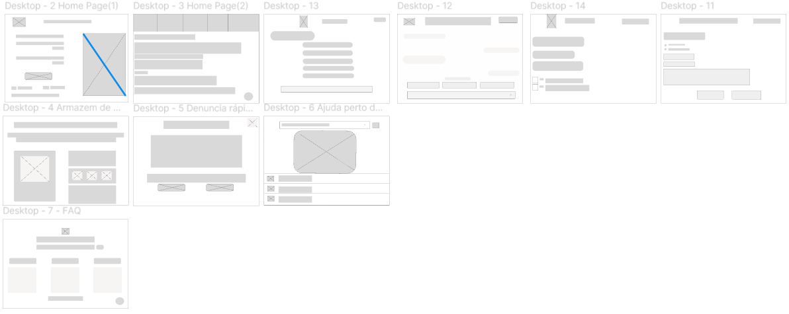

### User Flow

**✳️✳️✳️ COLOQUE AQUI O DIAGRAMA DE FLUXO DE TELAS ✳️✳️✳️**

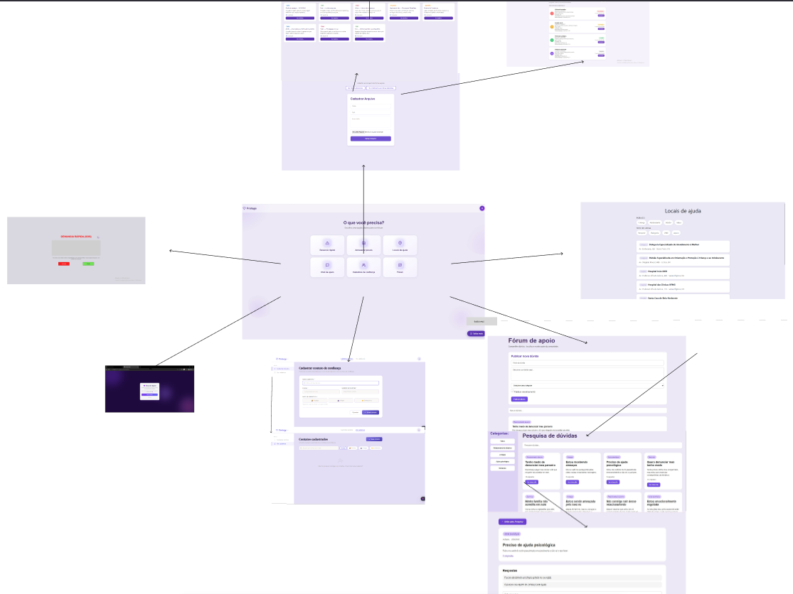

### Protótipo Interativo

✅ [Protótipo Interativo (Figma)](https://www.figma.com/proto/lXR7KDcyXh9lFUwJEylr2W/G3---Viol%C3%AAncia-Dom%C3%A9stica?node-id=42-32&p=f&t=KmVnU2dfF8QStxC4-1&scaling=scale-down&content-scaling=fixed&page-id=0%3A1&starting-point-node-id=42%3A32)

# Metodologia

Detalhes sobre a organização do grupo e o ferramental empregado.

## Ferramentas

Relação de ferramentas empregadas pelo grupo durante o projeto.

- Processo de Design Thinking | Miro | https://miro.com/app/board/uXjVGvSbycg=/
- Repositório de código | GitHub | https://github.com/ICEI-PUC-Minas-PMGES-TI/pmg-es-2026-1-ti1-0427200-protege
- Protótipo Interativo | Figma | https://www.figma.com/design/lXR7KDcyXh9lFUwJEylr2W/G3---Viol%C3%AAncia-Dom%C3%A9stica?t=82K9kQzsXFl8SmUS-0
- Comunicação da equipe | WhatsApp
- Editor de código | VS Code | https://code.visualstudio.com/

# Solução Implementada

Esta seção apresenta todos os detalhes da solução criada no projeto.

## Vídeo do Projeto

O vídeo a seguir traz uma apresentação do problema que a equipe está tratando e a proposta de solução. ⚠️ EXEMPLO ⚠️

[Vídeo do projeto](https://drive.google.com/file/d/1xTUYgOhwPOpp53TdFl3HJR2Nq_fBIc5M/view?usp=drive_link)

## Funcionalidades

### Funcionalidade 1 — Botão de Denúncia Rápida (SOS)

Permite que qualquer usuário registre uma denúncia de forma rápida e sigilosa, informando uma descrição breve do ocorrido, enviando sua localização e indicando um contato de confiança para ser acionado.

- **Estrutura de dados:** Denúncias
- **Responsável:** Anna Luiza
- **Instruções de acesso:**
  - Acesse a plataforma pelo navegador
  - Na tela inicial, clique no botão "SOS / Denúncia Rápida"
  - Preencha o formulário curto e confirme o envio

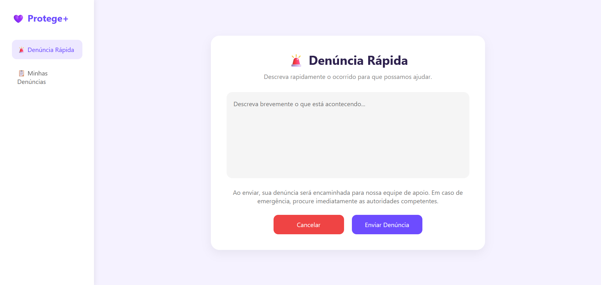

---

### Funcionalidade 2 — Mapa com Redes de Apoio

Exibe uma lista com delegacias, hospitais e ONGs próximas à localização do usuário, utilizando geolocalização.

- **Estrutura de dados:** Pontos de apoio (endereço, tipo, contato)
- **Responsável:** Matheus Campos
- **Instruções de acesso:**
  - Clique em "Locais de ajuda" no menu
  - Visualize os pontos de suporte próximos e clique para obter detalhes


---

### Funcionalidade 3 — Chat Anônimo

Oferece um canal de comunicação anônima com bot de triagem inicial e encaminhamento para profissionais de apoio psicológico ou jurídico.

- **Estrutura de dados:** Sessões de chat
- **Responsável:** Beatriz Almeida
- **Instruções de acesso:**
  - Acesse a plataforma e clique em "Chat de apoio "
  - Inicie a triagem com o bot
  - Receba um relatório completo sobre sua situação

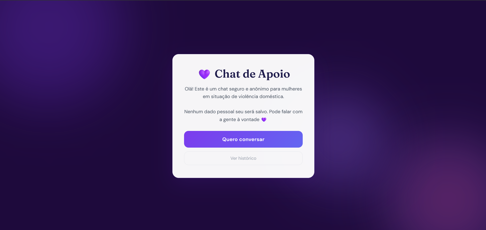

---

### Funcionalidade 4 — Cofre de Provas

Permite o armazenamento seguro de fotos, áudios e documentos como evidências.

- **Estrutura de dados:** Provas (arquivo, tipo, data, descrição)
- **Responsável:** Giovana Faria
- **Instruções de acesso:**
  - Acesse a plataforma e entre na seção "Armazenar provas"
  - Faça o upload de fotos, áudios ou documentos

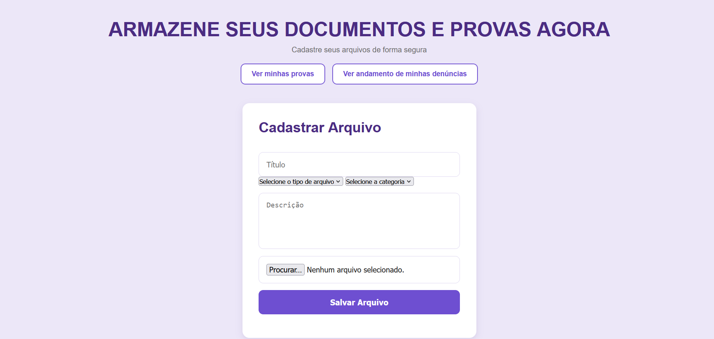

---

### Funcionalidade 5 — Contatos de Confiança

Permite cadastrar contatos de pessoas de confiança que podem ser acionadas em situações de emergência.

- **Estrutura de dados:** Contatos (nome, telefone, relação com o usuário)
- **Responsável:** Lukas Nathan
- **Instruções de acesso:**
  - Acesse a plataforma e entre em "Cadastros de confiança"
  - Clique em "Adicionar contato" e preencha os dados
  - O contato ficará disponível para ser acionado via botão SOS

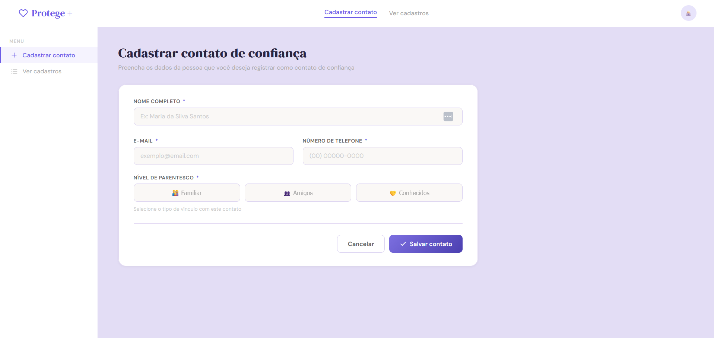

---

### Funcionalidade 6 — FAQ / Como Podemos te Ajudar?

Seção informativa com orientações sobre violência doméstica, identificação de sinais e encaminhamentos.

- **Responsável:** Maria Luiza Queiroz
- **Instruções de acesso:**
  - Acesse o menu e clique em "Forum"
  - Navegue pelas categorias de perguntas frequentes

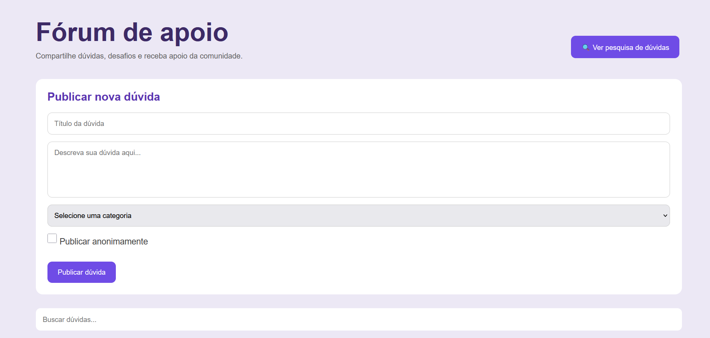

---

### Funcionalidade 7 — Minas denúncias

Acessar as denúncias feitas pela vítima

- **Estrutura de dados:** Denúncias
- **Responsável:** Anna Luiza
- **Instruções de acesso:**
  - Acesse a plataforma pelo navegador
  - Na tela inicial, clique no botão "SOS / Denúncia Rápida"
  - Acesse a parte, "Minhas Denúncias"

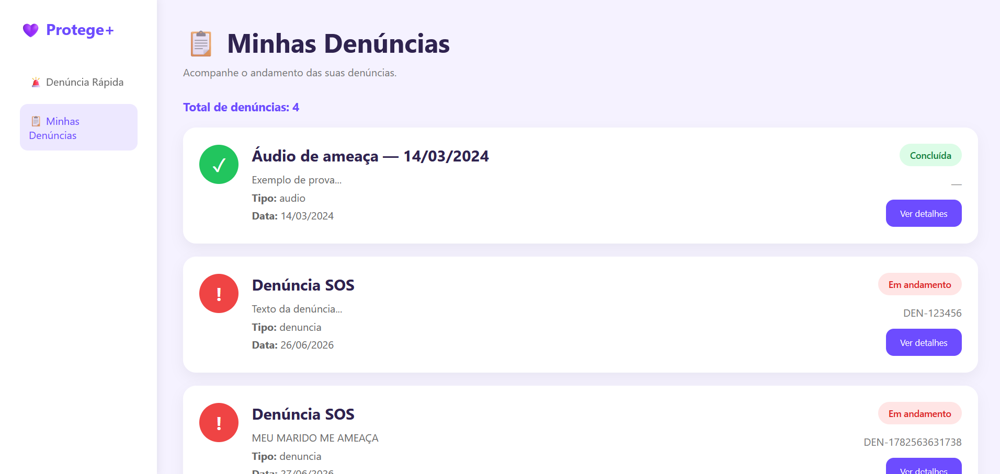

---

### Funcionalidade 8 — Ver minhas provas

Exibe uma lista com todas as provas armazenadas pela vítima

- **Estrutura de dados:** Provas (arquivo, tipo, data, descrição)
- **Responsável:** Giovana Faria
- **Instruções de acesso:**
  - Clique em "Armazenar Provas" no menu
  - Depois clique em "Ver minhas provas"

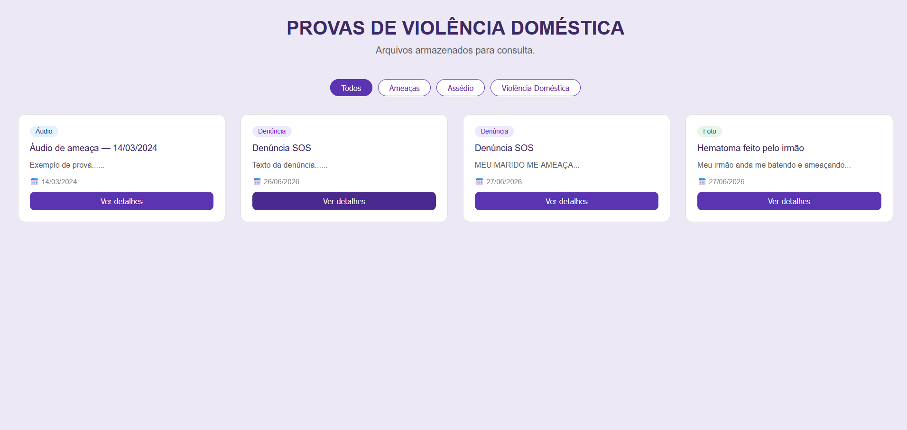

---

### Funcionalidade 9 — Biblioteca de Conteúdo

Oferece um canal de comunicação anônima com bot de triagem inicial e encaminhamento para profissionais de apoio psicológico ou jurídico.

- **Estrutura de dados:** Saiba mais
- **Responsável:** Beatriz Almeida
- **Instruções de acesso:**
  - Acesse a plataforma e clique em "Saiba mais"
  - Exibira informações úteis sobre Violência Domestica
  - Receba um relatório completo sobre sua situação

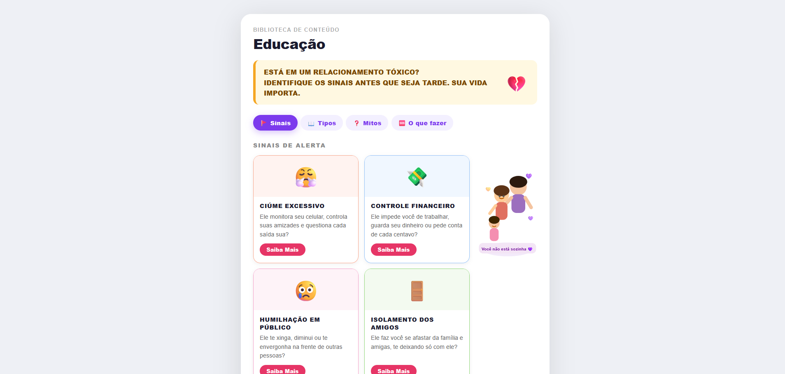

---

### Funcionalidade 10 — Contatos Cadastrados

Exibe os usuários cadastrados.

- **Estrutura de dados:** Contatos de confiança
- **Responsável:** Lukas Natan
- **Instruções de acesso:**
  - Acesse a plataforma e entre na seção "Cadastros de confiança"
  - Depos acesse "Ver Cadastros"

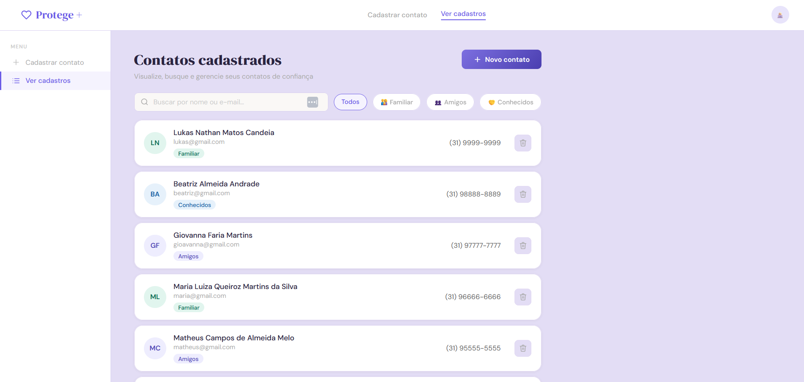

---

### Funcionalidade 11 — Pesquisas e dúvidas

Exibe pesquisas e dúvidas frequentes pelos usuários

- **Estrutura de dados:** Contatos (nome, telefone, relação com o usuário)
- **Responsável:** Maria Luiza Queiroz
- **Instruções de acesso:**
  - Acesse a plataforma e entre em "Forum"
  - Clique em "Ver pesquisas e duvidas"
  - E exibira as dúvidas frequentes

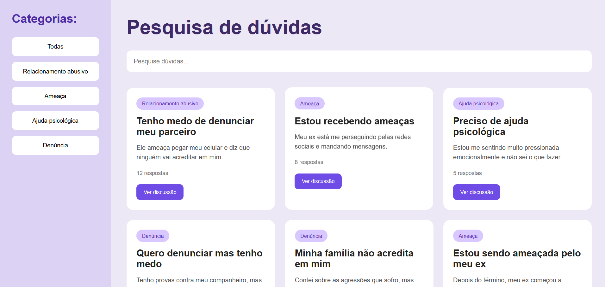

---

### Funcionalidade 12 — Painel de estatísticas

Seção informativa para mostrar as denuncias realizadas, como forma de incentivo

- **Responsável:** Matheus Campos Pereira
- **Instruções de acesso:**
  - Acesse o menu e clique em "Saiba mais"
  - Clique em "Estatísticas"
  - Exibirá as informações

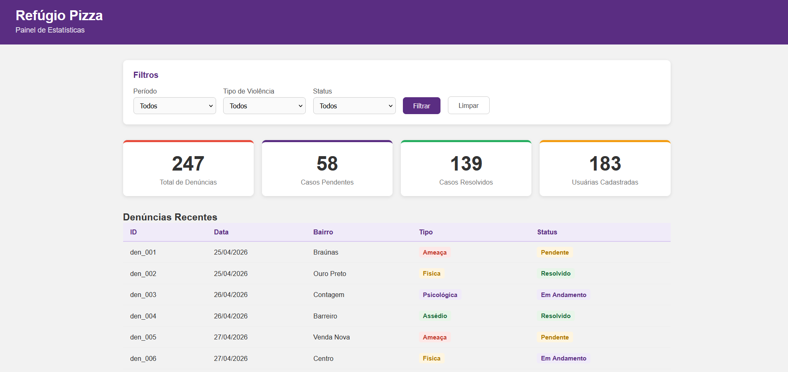

---

## Estruturas de Dados

Descrição das estruturas de dados utilizadas na solução com exemplos no formato JSON.Info

##### Estrutura de Dados - Contatos

Contatos da apoio

```json
{
  "contatos": [
    {
      "nome": "Lukas Nathan Matos Candeia",
      "email": "lukas@gmail.com",
      "telefone": "(31) 9999-9999",
      "nivel": "Familiar",
      "cadastradoEm": "26/06/2026",
      "id": "Qo6NfrI3tKE"
    },
    {
      "nome": "Beatriz Almeida Andrade",
      "email": "beatriz@gmail.com",
      "telefone": "(31) 98888-8889",
      "nivel": "Conhecidos",
      "cadastradoEm": "26/06/2026",
      "id": "Afoa3RbGqKM"
    },
    {
      "nome": "Giovanna Faria Martins",
      "email": "gioavanna@gmail.com",
      "telefone": "(31) 97777-7777",
      "nivel": "Amigos",
      "cadastradoEm": "26/06/2026",
      "id": "sWqXtbtDQWA"
    },
    {
      "nome": "Maria Luiza Queiroz Martins da Silva",
      "email": "maria@gmail.com",
      "telefone": "(31) 96666-6666",
      "nivel": "Familiar",
      "cadastradoEm": "26/06/2026",
      "id": "85eDVQIK_48"
    },
    {
      "nome": "Matheus Campos de Almeida Melo",
      "email": "matheus@gmail.com",
      "telefone": "(31) 95555-5555",
      "nivel": "Amigos",
      "cadastradoEm": "26/06/2026",
      "id": "cybkjuyIyEk"
    },
    {
      "nome": "Anna Luiza Pinto Pereira",
      "email": "anna@gmail.com",
      "telefone": "(31) 94444-4444",
      "nivel": "Amigos",
      "cadastradoEm": "26/06/2026",
      "id": "sC1tHzlegFg"
    },
    {
      "nome": "Giovana Faria Martins",
      "email": "giovana@gmail.com",
      "telefone": "(31) 99999-9999",
      "nivel": "Conhecidos",
      "cadastradoEm": "26/06/2026",
      "id": "DQyOEHZ"
    }
  ],
  "$schema": "./node_modules/json-server/schema.json"
}
```

##### Estrutura de Dados - Chat Bot

Chat de apoio com respostas baseadas em uma análise

```json
{
  "sinais": [
    {
      "id": "ciume",
      "emoji": "😤",
      "titulo": "Ciúme Excessivo",
      "resumo": "Ele monitora seu celular, controla suas amizades e questiona cada saída sua?",
      "cor": "#fff3f0",
      "corBorda": "#f9a58a",
      "items": [
        {
          "icon": "📱",
          "texto": "Pega seu celular sem pedir e lê todas as suas mensagens"
        },
        {
          "icon": "🚫",
          "texto": "Não deixa você sair sem ele, mesmo para ver família ou amigas"
        },
        {
          "icon": "😠",
          "texto": "Fica furioso quando você fala com homens, mesmo colegas de trabalho"
        },
        {
          "icon": "🔍",
          "texto": "Aparece de surpresa para te 'verificar' ou manda alguém te espionar"
        },
        {
          "icon": "😔",
          "texto": "Te acusa de traição sem motivo, fazendo você se sentir culpada"
        }
      ],
      "sabia": "Ciúme excessivo é uma das primeiras formas de violência psicológica. Começa devagar e vai aumentando com o tempo.",
      "frase": "Amor de verdade tem confiança. Você merece se sentir livre e respeitada!"
    },
    {
      "id": "financeiro",
      "emoji": "💸",
      "titulo": "Controle Financeiro",
      "resumo": "Ele impede você de trabalhar, guarda seu dinheiro ou pede conta de cada centavo?",
      "cor": "#f0f7ff",
      "corBorda": "#90c0f8",
      "items": [
        {
          "icon": "🏠",
          "texto": "Não deixa você trabalhar, dizendo que 'lugar de mulher é em casa'"
        },
        {
          "icon": "🧾",
          "texto": "Pede nota de tudo que você compra e questiona cada real gasto"
        },
        {
          "icon": "💳",
          "texto": "Coloca tudo no nome dele — casa, carro, contas — para você não ter nada"
        },
        {
          "icon": "🛒",
          "texto": "Não te dá dinheiro para comida, remédio ou necessidades dos filhos"
        },
        {
          "icon": "📚",
          "texto": "Impede você de estudar ou fazer cursos para crescer profissionalmente"
        }
      ],
      "sabia": "Quando ele controla o dinheiro, você fica sem como sair da situação. Isso é intencional — é uma armadilha chamada violência econômica.",
      "frase": "Independência financeira é um direito seu. Ninguém pode te impedir de trabalhar ou ter dinheiro próprio."
    },
    {
      "id": "humilhacao",
      "emoji": "😢",
      "titulo": "Humilhação em Público",
      "resumo": "Ele te xinga, diminui ou te envergonha na frente de outras pessoas?",
      "cor": "#fef3f8",
      "corBorda": "#f4a0c8",
      "items": [
        {
          "icon": "🗣️",
          "texto": "Te chama de 'burra', 'feia', 'inútil' ou 'louca' na frente dos outros"
        },
        {
          "icon": "😂",
          "texto": "Ri dos seus sonhos e conquistas, fazendo todo mundo achar graça"
        },
        {
          "icon": "📉",
          "texto": "Diz que você não é capaz de nada e que sem ele você não sobrevive"
        },
        {
          "icon": "😳",
          "texto": "Te envergonha em público: no mercado, na casa de parentes, na rua"
        },
        {
          "icon": "🔇",
          "texto": "Fala por você e decide por você, como se você não tivesse opinião"
        }
      ],
      "sabia": "A violência psicológica é tão séria quanto a física. Ela deixa marcas que não aparecem no corpo, mas doem muito na alma.",
      "frase": "Com o tempo, você pode começar a acreditar nessas mentiras. Mas são mentiras. Você tem valor. Você importa."
    },
    {
      "id": "isolamento",
      "emoji": "🚪",
      "titulo": "Isolamento dos Amigos",
      "resumo": "Ele faz você se afastar da família e amigas, te deixando só com ele?",
      "cor": "#f3faf0",
      "corBorda": "#90d878",
      "items": [
        {
          "icon": "👎",
          "texto": "Fala mal de toda sua família e amigas, inventando brigas e intrigas"
        },
        {
          "icon": "😡",
          "texto": "Faz cena toda vez que você quer visitar alguém ou sair com amigas"
        },
        {
          "icon": "💔",
          "texto": "Te faz escolher entre ele e as pessoas que você ama"
        },
        {
          "icon": "📵",
          "texto": "Monitora suas mensagens e ligações, ou te proíbe de ter celular"
        },
        {
          "icon": "🏠",
          "texto": "Quer que você fique em casa o tempo todo, apenas para ele e os filhos"
        }
      ],
      "sabia": "O isolamento é uma das táticas mais perigosas. Sem apoio de família e amigas, fica muito mais difícil pedir ajuda.",
      "frase": "Sua família e suas amigas são sua rede de proteção. Não abra mão delas. Reconecte-se com quem você confia."
    }
  ],
  "tipos": [
    {
      "id": 1,
      "emoji": "👊",
      "nome": "Física",
      "cor": "#ff5252",
      "bg": "#fff0f0",
      "desc": "Bater, empurrar, apertar, jogar objetos, machucar o corpo de qualquer forma. Se deixou marca ou não, é violência do mesmo jeito."
    },
    {
      "id": 2,
      "emoji": "🧠",
      "nome": "Psicológica",
      "cor": "#7c3aed",
      "bg": "#f5f0ff",
      "desc": "Xingar, ameaçar, humilhar, controlar, manipular, fazer você duvidar de si mesma. Machuca a mente e a autoestima."
    },
    {
      "id": 3,
      "emoji": "💸",
      "nome": "Econômica",
      "cor": "#f5a623",
      "bg": "#fffbf0",
      "desc": "Controlar seu dinheiro, impedir de trabalhar, tomar seus bens, não pagar pensão dos filhos."
    },
    {
      "id": 4,
      "emoji": "😔",
      "nome": "Moral",
      "cor": "#e63566",
      "bg": "#fff0f5",
      "desc": "Falar mal de você para outras pessoas, espalhar mentiras, destruir sua reputação, te difamar nas redes sociais."
    },
    {
      "id": 5,
      "emoji": "🚫",
      "nome": "Sexual",
      "cor": "#1a7a4a",
      "bg": "#f0fff8",
      "desc": "Forçar qualquer ato sexual sem seu consentimento, mesmo dentro do casamento. Você sempre tem o direito de dizer NÃO."
    }
  ],
  "mitos": [
    {
      "id": 1,
      "mito": "\"Ele bate, mas me ama muito\"",
      "verdade": "Amor e violência não andam juntos. Quem ama, respeita. Bater é crime, não é forma de amar."
    },
    {
      "id": 2,
      "mito": "\"Ele só faz isso quando bebe\"",
      "verdade": "A bebida não causa violência — o agressor escolhe ser violento. Muitos homens bebem e nunca batem em ninguém."
    },
    {
      "id": 3,
      "mito": "\"Eu provoquei, fui eu quem causou\"",
      "verdade": "Nada que você diga ou faça justifica ser agredida. A culpa é sempre de quem agride, nunca de quem é agredida."
    },
    {
      "id": 4,
      "mito": "\"Em briga de marido e mulher ninguém mete a colher\"",
      "verdade": "Violência doméstica é crime! Qualquer pessoa pode e deve ligar 180 ou 190 ao testemunhar ou suspeitar."
    },
    {
      "id": 5,
      "mito": "\"Se fosse tão ruim, ela teria saído\"",
      "verdade": "Sair é difícil e perigoso. O medo, a dependência financeira e o amor confundem tudo. Ela precisa de apoio, não de julgamento."
    }
  ],
  "passos": [
    {
      "id": 1,
      "num": "1",
      "emoji": "🏃‍♀️",
      "titulo": "Saia do perigo imediato",
      "desc": "Se estiver em perigo agora, saia do local e vá para um lugar seguro: casa de familiar, vizinha de confiança ou delegacia."
    },
    {
      "id": 2,
      "num": "2",
      "emoji": "📞",
      "titulo": "Ligue 180 ou 190",
      "desc": "O 180 é a Central da Mulher — gratuito, sigiloso, 24h. O 190 é a Polícia. Ambos podem te ajudar agora mesmo."
    },
    {
      "id": 3,
      "num": "3",
      "emoji": "🏥",
      "titulo": "Cuide das marcas",
      "desc": "Vá a uma UPA ou hospital. Mesmo que não queira registrar BO agora, guarde o atestado médico. Ele é uma prova importante."
    },
    {
      "id": 4,
      "num": "4",
      "emoji": "📋",
      "titulo": "Registre o Boletim de Ocorrência",
      "desc": "Vá à Delegacia da Mulher (ou qualquer delegacia à noite). Leve documentos seus e dos filhos se puder. Não é obrigatório, mas ajuda."
    },
    {
      "id": 5,
      "num": "5",
      "emoji": "⚖️",
      "titulo": "Peça Medida Protetiva",
      "desc": "O juiz pode proibir o agressor de chegar perto de você em até 48 horas. Peça na delegacia ou no CREAS da sua cidade."
    },
    {
      "id": 6,
      "num": "6",
      "emoji": "🤝",
      "titulo": "Busque apoio",
      "desc": "CRAS, CREAS e Casas-Abrigo oferecem apoio psicológico, jurídico e social gratuito. Você não precisa passar por isso sozinha."
    }
  ],
  "visualizados": []
}
```

##### Estrutura de Dados - Locais de ajuda

Locais de ajuda

```json
{
  "locais": [
    {
      "id": 1,
      "tipo": "delegacia",
      "publico": ["adulto", "idoso"],
      "nome": "Delegacia Especializada de Atendimento à Mulher",
      "endereco": "Av. Barbacena, 288 - Barro Preto, BH"
    },
    {
      "id": 2,
      "tipo": "delegacia",
      "publico": ["criança", "adolescente"],
      "nome": "Divisão Especializada em Orientação e Proteção à Criança e ao Adolescente",
      "endereco": "Av. Olegário Maciel, 600 - Centro, BH"
    },
    {
      "id": 3,
      "tipo": "hospital",
      "publico": ["criança", "adolescente", "adulto", "idoso"],
      "nome": "Hospital João XXIII",
      "endereco": "Av. Professor Alfredo Balena, 400 - Santa Efigênia, BH"
    },
    {
      "id": 4,
      "tipo": "hospital",
      "publico": ["criança", "adolescente", "adulto", "idoso"],
      "nome": "Hospital das Clínicas UFMG",
      "endereco": "Av. Professor Alfredo Balena, 110 - Santa Efigênia, BH"
    },
    {
      "id": 5,
      "tipo": "hospital",
      "publico": ["criança", "adolescente", "adulto", "idoso"],
      "nome": "Santa Casa de Belo Horizonte",
      "endereco": "Av. Francisco Sales, 1111 - Santa Efigênia, BH"
    },
    {
      "id": 6,
      "tipo": "ong",
      "publico": ["adulto", "idoso"],
      "nome": "Casa Tina Martins",
      "endereco": "Rua Paraíba, 641 - Funcionários, BH"
    },
    {
      "id": 7,
      "tipo": "ong",
      "publico": ["adulto"],
      "nome": "Servas - Serviço Social Autônomo",
      "endereco": "Av. Cristóvão Colombo, 683 - Funcionários, BH"
    },
    {
      "id": 8,
      "tipo": "apoio",
      "publico": ["adulto", "idoso"],
      "nome": "Centro de Referência da Mulher Benvinda",
      "endereco": "Rua Hermilo Alves, 34 - Santa Tereza, BH"
    }
  ]
}
```

##### Estrutura de Dados - Painel estatística

Denúncias realizadas informativas

```json
  "denuncias": [
    {
      "id": "den_001",
      "data": "25/04/2026",
      "bairro": "Braúnas",
      "tipo": "ameaca",
      "status": "pendente"
    },
    {
      "id": "den_002",
      "data": "25/04/2026",
      "bairro": "Ouro Preto",
      "tipo": "fisica",
      "status": "resolvido"
    },
    {
      "id": "den_003",
      "data": "26/04/2026",
      "bairro": "Contagem",
      "tipo": "psicologica",
      "status": "andamento"
    },
    {
      "id": "den_004",
      "data": "26/04/2026",
      "bairro": "Barreiro",
      "tipo": "assedio",
      "status": "resolvido"
    },
    {
      "id": "den_005",
      "data": "27/04/2026",
      "bairro": "Venda Nova",
      "tipo": "ameaca",
      "status": "pendente"
    },
    {
      "id": "den_006",
      "data": "27/04/2026",
      "bairro": "Centro",
      "tipo": "fisica",
      "status": "andamento"
    },
    {
      "id": "den_007",
      "data": "28/04/2026",
      "bairro": "Braúnas",
      "tipo": "psicologica",
      "status": "resolvido"
    },
    {
      "id": "den_008",
      "data": "29/04/2026",
      "bairro": "Contagem",
      "tipo": "ameaca",
      "status": "resolvido"
    }
  ]
```

##### Estrutura de Dados - Armazenamento de provas

Armazenamento de provas

```json
"provas": [
    {
      "id": 1,
      "titulo": "Áudio de ameaça — 14/03/2024",
      "tipo": "audio",
      "categoria": "ameaca",
      "data": "14/03/2024",
      "descricao": "Exemplo de prova...",
      "arquivo": "ameaca_14mar.mp3",
      "origem": "upload",
      "status": "Concluída"
    },
    {
      "id": 2,
      "titulo": "Denúncia SOS",
      "tipo": "denuncia",
      "categoria": "SOS",
      "data": "26/06/2026",
      "descricao": "Texto da denúncia...",
      "protocolo": "DEN-123456",
      "origem": "denuncia",
      "status": "Em andamento"
    },
    {
      "id": 1782563631710,
      "titulo": "Denúncia SOS",
      "descricao": "MEU MARIDO ME AMEAÇA",
      "tipo": "denuncia",
      "categoria": "SOS",
      "data": "27/06/2026",
      "protocolo": "DEN-1782563631738",
      "origem": "denuncia",
      "status": "Em andamento"
    },
    {
      "id": 1782563784575,
      "titulo": "Hematoma feito pelo irmão",
      "tipo": "foto",
      "categoria": "violencia",
      "descricao": "Meu irmão anda me batendo e ameaçando",
      "arquivo": "14.png",
      "tamanho": "927.2 KB",
      "data": "27/06/2026",
      "protocolo": "PRV-1782563784577",
      "origem": "upload",
      "status": "Concluída"
    }
]
```

# Referências

- BRASIL. Lei nº 11.340, de 7 de agosto de 2006 (Lei Maria da Penha). Brasília: Presidência da República, 2006. Disponível em: https://www.planalto.gov.br/ccivil_03/_ato2004-2006/2006/lei/l11340.htm

- FÓRUM BRASILEIRO DE SEGURANÇA PÚBLICA. Anuário Brasileiro de Segurança Pública 2023. São Paulo: FBSP, 2023. Disponível em: https://forumseguranca.org.br/anuario-brasileiro-seguranca-publica/

- INSTITUTO MARIA DA PENHA. O que é violência doméstica?. Disponível em: https://www.institutomariadapenha.org.br/violencia-domestica/o-que-e-violencia-domestica.html

- CENTRAL DE ATENDIMENTO À MULHER — Ligue 180. Disponível em: https://www.gov.br/mdh/pt-br/navegue-por-temas/politicas-para-mulheres/ligue-180
